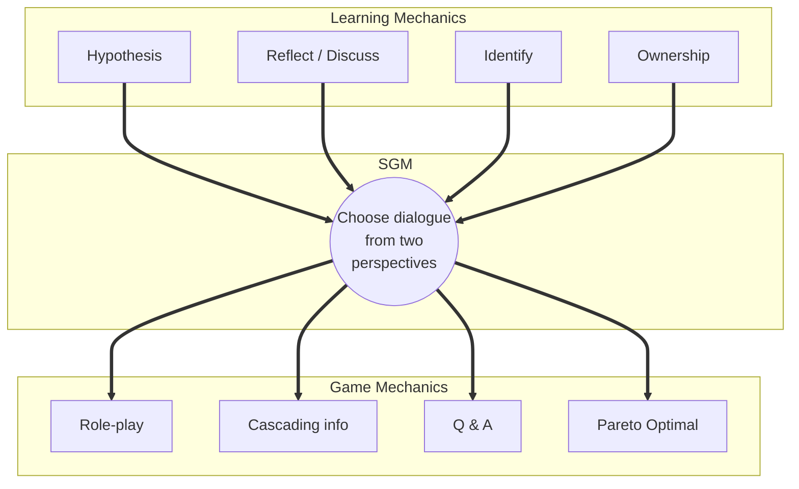
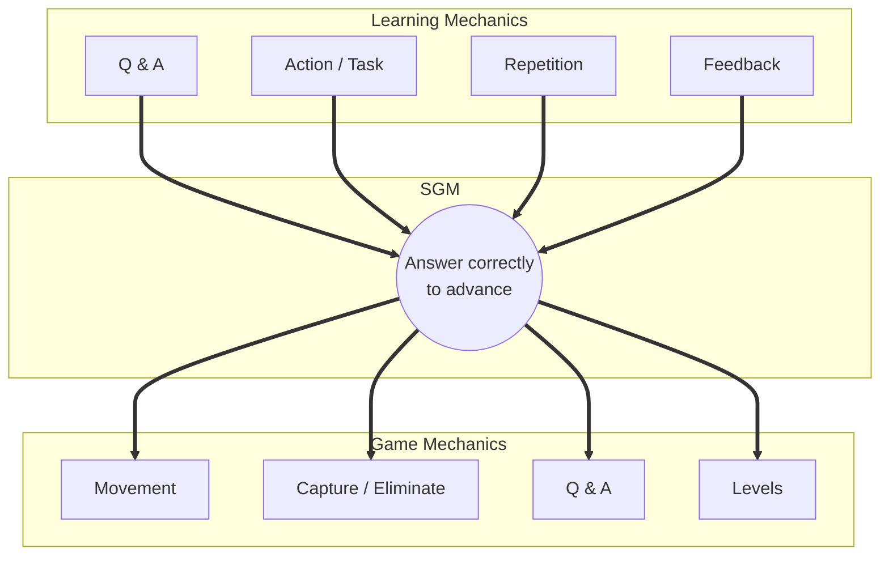

---
# try also 'default' to start simple
theme: seriph
# new background image
# background: https://raw.githubusercontent.com/visualcomputing/p5.treegl/main/p5.treegl.png
background: "p5.tree.png"
# apply any unocss classes to the current slide
class: 'text-center'
# https://sli.dev/custom/highlighters.html
highlighter: shiki
# some information about the slides, markdown enabled
info: |
  ## DGBL: Design & Implementation
  Stage 2 & 3 keynote for the Serious Games course.
transition: slide-left
title: Problem & Context
mdc: true
hideInToc: true
---

# DGBL: From Problem to Serious Game
## Stage 2 & 3: Design & Implement, or Iterate

A methodological guide for creating digital game-based learning experiences.

---
layout: center
---

# Outline

1. **Where we stand** — Stage 1 milestone, two paths ahead.
2. **The LM-GM framework** — how to bridge pedagogy and gameplay, with cognitive depth.
3. **Two tools for proof-of-concept** — Twine and GDevelop.
4. **Worked examples** — *Academical* (Twine) and *Adventure with Relational Algebra* (GDevelop).
5. **Path B** — the theoretical track.
6. **Stage 3** — peer review and the academic report.

---
layout: section
---

# Where We Stand
Recapping progress and setting the next goals.

---
layout: center
---

# Stage 1 Milestone Cleared

**Baseline successfully established.**

* **Research problem defined:** all groups have identified their core DGBL question.
* **Mandatory requirement met:** you are cleared to move into the active phase.
* **Focus from here on:** the quality of your process — whether deepening theory or building a prototype — will define your final outcome.

---
layout: center
---

# The Fork in the Road (Stage 2)

> Each group must commit to one of two distinct paths.

### Path A — The Builder
**Design & Implementation.** Map your research to a playable prototype using a framework like LM-GM.

### Path B — The Researcher
**Deepen the theoretical proposal.** No prototype — but the academic rigor goes up: stronger framework, more sources, sharper hypotheses.

---
layout: section
---

# Path A: Design Methodology
The bridge between research and gameplay.

---
layout: center
---

# The LM-GM Framework
### Learning Mechanics ↔ Game Mechanics

A descriptive model formalized by **Arnab et al. ([2015](https://doi.org/10.1111/bjet.12113))** — building on Lim et al. (2013) — to bridge **pedagogical intent** and **playable actions**.

* **Learning Mechanics (LM):** pedagogical practices the design enacts — *Identify, Hypothesize, Reflect, Repetition, Feedback*. Theory-agnostic; can be classified by depth (Bloom / Anderson) or domain (cognitive / affective). Catalog of LMs in [Arnab et al. (2015)](https://doi.org/10.1111/bjet.12113).
* **Game Mechanics (GM):** methods the player invokes to interact with the game — *Collect, Capture/Eliminate, Manage Resources*. Catalog of GMs in [Arnab et al. (2015)](https://doi.org/10.1111/bjet.12113), distilled from [Järvinen (2008)](http://urn.fi/urn:isbn:978-951-44-7252-7), [Sicart (2008)](https://gamestudies.org/0802/articles/sicart), [Bellotti et al. (2009)](https://doi.org/10.1145/1541895.1541903).
* **Serious Game Mechanic (SGM):** the **domain-specific** design decision that links an LM to a GM. This is where the designer's craft lives.

> *Two theory-agnostic vocabularies, joined by a domain-specific bridge.*

<!--
Talking points:
- Three groups, not two. The center (SGM) is the most important because it's where the designer's choice becomes visible — and it's domain-specific, so no catalog exists for it.
- LM and GM catalogs are theory-agnostic: a team can use the same LM "Identify" whether they ground it in Bloom, Anderson, or Bloom's affective domain. Same for GMs across Järvinen/Sicart/Bellotti.
- This is what makes LM-GM a meta-framework: it tells you *how to map*, not *what to map*. The "what" comes from your Stage 1 problem.
- Push: ask each group to name one candidate LM and one candidate GM from their problem. The SGM is what they have to *invent* during Stage 2.
-->

---
layout: default
---

# How to read the LM-GM map

Pedagogy on the left, gameplay on the right — the designer's job is to draw the links.

Didactic, cross-domain example (cyber, software, project management). Levels: [Anderson & Krathwohl 2001](https://people.ucsc.edu/~ktellez/blooms_taxonomy.pdf); affective = Bloom 1964; transversal = every level. Full catalog: [Arnab et al. (2015)](https://doi.org/10.1111/bjet.12113), Figs 2–4.

| Learning Mechanic | Cognitive level | → linked to → | Game Mechanic |
|---|:---:|:---:|---|
| Discover | Remember | recall key terms | Cut-scenes, Tokens |
| Identify | Understand | spot phishing | Selecting / Collecting |
| Action / Task | Apply | act under stress | Capture / Eliminate, Time pressure |
| Observation | Analyze | diagnose root cause | Feedback, Realism |
| Hypothesis | Evaluate | test a plan | Resource Management |
| Planning | Create | design a strategy | Design / Editing, Strategy |
| Motivation | (affective) | earn status | Rewards / Status |
| Feedback | (transversal) | reinforce learning | Levels, Feedback |

<!--
Talking points:
- Each row is one design hypothesis: this LM, at this cognitive level, will be carried by this GM. The middle column is the Serious Game Mechanic (SGM) — the designer's bridge.
- The *Cognitive level* column is dimmed because it is a **cross-theory annotation** — it follows Anderson & Krathwohl (2001), not the LM-GM framework itself. Worth saying out loud so students don't conflate the two.
- Cognitive level matters because it constrains GM choice. A "Remember" LM is fine with passive GMs (Cut-scenes); a "Create" LM demands active, open-ended GMs (Design/Editing). Higher levels demand decisions, not reflexes.
- Why two rows are bracketed: Motivation and Feedback don't fit Bloom's cognitive pyramid. Motivation belongs to Bloom's **affective domain** (Krathwohl, Bloom & Masia 1964) — it's about engagement and attitudes, not knowing. Feedback is **transversal** — every cognitive level needs feedback to close the learning loop. Worth saying out loud: "not every LM is cognitive; some are affective or structural."
- LM column comes from pedagogical theory: behaviorism, constructivism, cognitivism. Full catalog in Arnab et al. (2015).
- GM column comes from game design literature: Järvinen, Sicart, Bellotti. Full catalog in Arnab et al. (2015).
- A good Serious Game has few, deliberate links — too many = noise; none = disconnected from learning.
- Ask the groups: which row most resembles their core LM? If their LM doesn't fit any of these, that's a sign they need to refine their Stage 1 problem statement.

═══════════════════════════════════════════════
CONTEXT ON BLOOM (in case anyone asks):

**Origin.** Project started in 1948 at an APA convention in Boston. Benjamin Bloom chaired a committee of "college examiners" who needed a common vocabulary for writing learning objectives — the post-WWII G.I. Bill had flooded US universities with veterans, and examiners across institutions were drowning in inconsistent assessment criteria. Five years of conferences (1949–1953) produced the 1956 publication.

**Authors.** Despite the name, it was a committee: Bloom (editor), Englehart, Furst, Hill, Krathwohl. The book is *Taxonomy of Educational Objectives: The Classification of Educational Goals — Handbook I: Cognitive Domain* (David McKay, NY, 1956).

**Three domains.** Bloom proposed cognitive (knowledge), affective (emotion), psychomotor (action). Handbook I (1956) covered cognitive; Handbook II (1964, Krathwohl as lead) covered affective; the psychomotor handbook was never written by the original committee.

**Cognitive levels (1956 original):** Knowledge → Comprehension → Application → Analysis → Synthesis → Evaluation. Hypothesized as cumulative.

**The 2001 revision (Anderson & Krathwohl).** Three changes: (1) nouns became action verbs (Knowledge → Remember, etc.); (2) Synthesis was renamed Create and moved to the top, swapping with Evaluation; (3) added a second dimension — types of knowledge (factual, conceptual, procedural, metacognitive). This is the version used in syllabi today and on this slide.

**Why the LM-GM authors anchor their model in Bloom.** Bloom is the shared vocabulary every educator already speaks. Had they used Vygotsky or Sweller, they would have had to teach the theory first.

**Common critiques.** The hierarchy isn't strictly cumulative — empirical work shows levels overlap and skip more than the pyramid suggests. Bloom is *descriptive* (classifies what you want students to do), not *explanatory* (doesn't say *how* learning happens; for that, Piaget, Vygotsky, Bruner, or Sweller's cognitive load theory). Also assumes an individual learner, not a situated one — critiques from social constructivism apply.
-->

---
layout: center
---

# Quick Design Checklist

Before coding anything, your team must answer these 3 questions:

1. **What is the core loop?**
   *If the player spends 80% of their time jumping, the learning must happen during the jump.*

2. **Is there a direct LM ↔ GM link?**
   *Does this game mechanic actually carry your Stage 1 research question, or is it just decoration?*

3. **Is there "noise"?**
   *If a game element neither entertains nor teaches, cut it out immediately.*

<!--
Talking points:
- These three questions are the LM-GM test in plain language. If a group can't answer them, they're not ready to code.
- "Core loop" is the moment-to-moment activity, not the meta-structure. Re-Mission's core loop is shooting cancer cells; the meta-structure is the patient narrative.
- Question 2 is the heart of the framework: every game element must be traceable to either an LM (it teaches) or an entertainment-only purpose (it engages). Decoration that does neither is dead weight.
- Question 3 is hard because students fall in love with their ideas. Force them to justify each mechanic in writing.
-->

---
layout: section
---

# Two Tools for Proof-of-Concept
Pick the one that matches your core loop.

---
layout: center
---

# Twine and GDevelop, side by side

Both are **free, open source**, and designed to lower the technical barrier so your team can ship a playable prototype quickly. They are not interchangeable: each fits a different kind of *core loop*.

* **[Twine](https://twinery.org/) — no-code, narrative.**
  Build *passages* of text linked by player choices; exports HTML directly. Best for **decision-making, ethics, clinical reasoning, branching scenarios** — anywhere the LM is *Choose / Reflect / Identify*.

* **[GDevelop](https://gdevelop.io/) — low-code, action.**
  Build *events* as visual *Conditions → Actions* (e.g. *if player touches enemy, lose a life*); exports web/desktop/mobile. Best for **spatial logic, resource management, time pressure, simulators** — anywhere the LM is *Action / Task / Analyse*.

> *Pick the tool whose primitive matches your core loop: passages for stories, events for actions.*

<!--
Talking points:
- The primitive matters more than the tool. Twine's primitive is a *passage* (a text node with outgoing links); GDevelop's primitive is an *event* (a Condition→Action rule). Choose based on what your core loop actually does.
- "No-code" vs "low-code" is real: Twine literally needs zero programming knowledge for a working prototype; GDevelop needs you to think procedurally even though there's no syntax.
- Both export to web. Both are free, both are open source. There is no licensing risk for student work.
- Discourage tool-shopping. Pick one in week 1 and commit. Switching tools mid-project burns time that should go into the LM-GM mapping and content.
- If a group has a hybrid core loop (e.g. clinical reasoning with timed pressure), Twine wins because narrative dominates. If the core loop is action-driven with embedded text, GDevelop wins because text is easy to add but real-time logic isn't easy in Twine.
-->

---
layout: section
---

# Worked Example 1
Applying the LM-GM framework to a real Twine serious game.

---
layout: center
---

# Case study: *Academical*

A choice-based interactive narrative built in **Twine** to teach **Responsible Conduct of Research (RCR)**.

* **Authors:** Melcer, Ryan, Junius, Kreminski, Squinkifer, Hill, Wardrip-Fruin (UC Santa Cruz, ALT Games Lab).
* **Published in:** *FDG 2020* (ACM Foundations of Digital Games) — **Exceptional Paper Award**. Extended chapter in Springer (2022).
* **Evaluation:** controlled study vs. traditional web-based RCR materials; significant gains in engagement, moral reasoning, and knowledge.
* **Format:** 9 scenarios; each centers on a dialogue between two stakeholders. Player chooses lines; reaches one of several endings; replays from the *other* perspective.

> 🎮 Project page & paper: [altgameslab.soe.ucsc.edu/academical](https://altgameslab.soe.ucsc.edu/academical/)

<!--
Talking points:
- Pick this case for groups doing ethics, clinical reasoning, or any domain where the *deliberation itself* is the learning. Examples in this cohort: TDAH (ethical consent for adaptive systems), Neurociencia (clinical diagnosis), Cyber (decision-making under social engineering).
- The "Exceptional Paper Award" at FDG is the field's most respected venue for design-research crossover. Worth flagging to legitimize Twine as a serious academic tool.
- The original-vs-revisit mechanic is the cleanest example of role-taking I've seen in literature. It's the SGM that turns this from a quiz into something else.
- Controlled study: this is rare in serious games. Most papers describe a game and stop. Academical actually measured against a baseline (web-based RCR materials) and won.
-->

---
layout: two-cols
---

# *Academical* — LM-GM map

::right::

| GM | LM | Implementation |
|---|---|---|
| Role-play | Ownership, Identify | Player controls one stakeholder per scenario |
| Cascading info | Reflect / Discuss | Each choice reveals new context |
| Q & A | Hypothesis | Dialogue options as multiple-choice |
| Pareto Optimal | Reflect / Discuss | Replay from the other perspective |

The replay-from-the-other-side mechanic turns a quiz on ethics into a serious game on *moral reasoning*.

LM‑GM mapping built by applying the Arnab et al. (2015) framework — not reproduced from the original paper.

<!--
Talking points:
- The mapping here is ours, not from the original paper. Melcer et al. describe Academical in their own terms; we re-cast it through LM-GM as an exercise.
- Notice the SGM "Choose dialogue from two perspectives" — that's the unit of design innovation. Without the replay-from-the-other-side mechanic, this is just a choice-based quiz.
- *Pareto Optimal* as a GM is unusual: most games have a single best ending. Here, no ending dominates — each perspective reveals trade-offs invisible from the other side. That's what teaches moral reasoning.
- This is the exercise students should do for their own game: take their LM list, take their GM list, identify the SGM that bridges them, and write a row in the table for each one.
-->

---
layout: section
---

# Worked Example 2
Applying the LM-GM framework to a real GDevelop serious game.

---
layout: center
---

# Case study: *Adventure with Relational Algebra*

A platformer serious game built in **GDevelop** as a proof of concept of a model for semi-automatic SG generation, used to reinforce **relational algebra** in a database course.

* **Authors:** Silva-Vásquez, Rosales-Morales, Benítez-Guerrero, Alor-Hernández, Mezura-Godoy, Montané-Jiménez (Universidad Veracruzana, México).
* **Paper:** *Model for Semi-Automatic Serious Games Generation*, **Applied Sciences** (MDPI, 2023) — [doi.org/10.3390/app13085158](https://doi.org/10.3390/app13085158)
* **Evaluation:** 75 university students, structured survey on gameplay, mechanics, story, and usability.
* **Format:** 2D platformer + multiple-choice gates between levels; correct answers progress, wrong ones cost a life.

> 🎮 Play it live: [gd.games/pedrosilva/algebra-relacional-bd](https://gd.games/pedrosilva/algebra-relacional-bd)

*The paper explicitly cites the LM-GM framework (Lim et al., 2013) as one of its conceptual references.*

<!--
Talking points:
- Pick this case for groups with technical or procedural content: Refactor Quest (refactoring tactics), Sprint Flow Manager (Scrum events), Quantum Tic-Tac-Toe (move semantics). The platformer-as-content-delivery genre maps cleanly to any topic where there are discrete correct answers.
- The paper's contribution is the *semi-automatic generation model*, not the game itself. The game is the proof of concept. This is a useful pattern: don't sell the game, sell the methodology that produced it.
- 75 students is a respectable sample for serious-games research. Many published SG papers evaluate with N<30.
- The "wrong answer costs a life" mechanic is classic *negative feedback* — it works because it preserves flow. Compare with NeurEscape, where wrong answers will need a different feedback strategy that doesn't break the escape-room tension.
-->

---
layout: two-cols
---

# *Adventure with Relational Algebra* — LM-GM map

::right::

| GM | LM | Implementation |
|---|---|---|
| Movement | Action/Task | Run & jump across the level |
| Capture / Eliminate | Action/Task | Avoid enemies, collect items |
| Q & A | Q&A, Identify | Multiple-choice gates between levels |
| Levels | Repetition, Feedback | Wrong answer → lose life; correct → progress |

Remove the SGM and the game becomes Mario-Bros (no learning); remove the platforming and it becomes a quiz (no fun).

LM‑GM mapping built by applying the Arnab et al. (2015) framework — not reproduced from the original paper.

<!--
Talking points:
- The SGM here ("Answer correctly to advance") is *gate-based* — discrete checkpoints. Compare with Academical's SGM, which is *continuous role-taking*. Two completely different ways to bridge LM-GM, both valid.
- The platforming itself doesn't teach relational algebra. The platforming exists to make the quiz tolerable. This is honest design: the game part is for engagement, the gate part is for content. The SGM holds them together.
- A student might ask: "couldn't this be a Kahoot quiz?" The answer: yes, but the platformer adds intrinsic motivation that Kahoot's extrinsic competition can't replicate. The lit (Wouters, Plass, others) shows this matters for retention over time.
- Encourage students to think: which SGM pattern fits their game? Gate-based, role-taking, both, or something else?
-->

---
layout: center
---

# ⚠️ Golden Rule

> **Control your scope.**
>
> A functional, evaluable prototype is infinitely better than an incomplete, over‑designed game.

---
layout: section
---

# Path B: The Theoretical Track
A more demanding alternative — not a fallback.

---
layout: center
---

# What Path B actually requires

Choosing **not to build** does **not** mean less work. It means a different kind of work, held to a higher academic standard:

* **Substantially expanded literature review:** broader corpus, explicit inclusion/exclusion criteria, Q1/Q2 sources.
* **Explicit theoretical framework:** position your problem inside an existing pedagogical or design theory (e.g., LM-GM, Bloom, Flow, EDTF, Self-Determination).
* **Sharpened hypothesis & operationalization:** define variables, measurable constructs, and a credible evaluation design — even if not executed.
* **Gap analysis with evidence:** show *why* the literature leaves your problem open, not just *that* it does.

---
layout: center
---

# Stage 3: Closing the Loop

Whatever path you take, Stage 3 is essentially the same:

* **Academic-style [research report](https://journal.seriousgamessociety.org/index.php/IJSG/announcement/view/4)**
* **Project presentation**
* **Peer review**

---
layout: center
---

# References — LM-GM & Theoretical Anchors

**Core framework (LM-GM)**
* Arnab, S., Lim, T., Carvalho, M. B., Bellotti, F., de Freitas, S., Louchart, S., Suttie, N., Berta, R., & De Gloria, A. (2015). *Mapping learning and game mechanics for serious games analysis*. **British Journal of Educational Technology**, 46(2), 391–411. [doi.org/10.1111/bjet.12113](https://doi.org/10.1111/bjet.12113)
* Lim, T., et al. (2013). *The LM-GM Framework for Serious Games Analysis*. ECGBL. [ResearchGate](https://www.researchgate.net/publication/259296509_The_LM-GM_Framework_for_Serious_Games_Analysis)

**Cognitive depth (LM side)**
* Anderson, L. W., & Krathwohl, D. R. (2001). *A Taxonomy for Learning, Teaching, and Assessing*. Longman. [Krathwohl (2002) overview](https://people.ucsc.edu/~ktellez/blooms_taxonomy.pdf)
* Bloom, B. S. (1956). *Taxonomy of Educational Objectives, Handbook I: Cognitive Domain*. David McKay.

**Game Mechanics (GM side)**
* Järvinen, A. (2008). *Games without Frontiers*. PhD thesis, U. of Tampere. [PDF](http://urn.fi/urn:isbn:978-951-44-7252-7)
* Sicart, M. (2008). *Defining Game Mechanics*. **Game Studies**, 8(2). [Open access](https://gamestudies.org/0802/articles/sicart)
* Bellotti, F., Berta, R., De Gloria, A., & Primavera, L. (2009). *Enhancing the educational value of video games*. **ACM Computers in Entertainment**, 7(2), Article 23. [doi.org/10.1145/1541895.1541903](https://doi.org/10.1145/1541895.1541903)

---
layout: center
---

# References — Worked Examples, Inclusive Design & Tools

**Worked examples**
* Melcer, E. F., et al. (2020). *Getting Academical: A Choice-Based Interactive Storytelling Game for Teaching Responsible Conduct of Research*. **FDG 2020** (ACM). 🎮 [altgameslab.soe.ucsc.edu/academical](https://altgameslab.soe.ucsc.edu/academical/)
* Silva-Vásquez, P. O., et al. (2023). *Model for Semi-Automatic Serious Games Generation*. **Applied Sciences**, 13(8), 5158. [doi.org/10.3390/app13085158](https://doi.org/10.3390/app13085158) · 🎮 [gd.games/pedrosilva/algebra-relacional-bd](https://gd.games/pedrosilva/algebra-relacional-bd)

**Inclusive design**
* Cano, S., et al. *The TEGA Toolkit* — [Springer chapter](https://link.springer.com/chapter/10.1007/978-3-030-77599-5_37). Cognitive accessibility, representation, flexibility.

**Tools (free & open source)**
* [Twine](https://twinery.org/) — narrative, no-code, exports HTML.
* [GDevelop](https://gdevelop.io/) — 2D action, low-code event system, exports web/desktop/mobile.

---
layout: center
class: text-center
---

# Questions?

## Thank you 🙏

> Bring your Stage 1 dossier and your draft LM-GM table to the next session.
