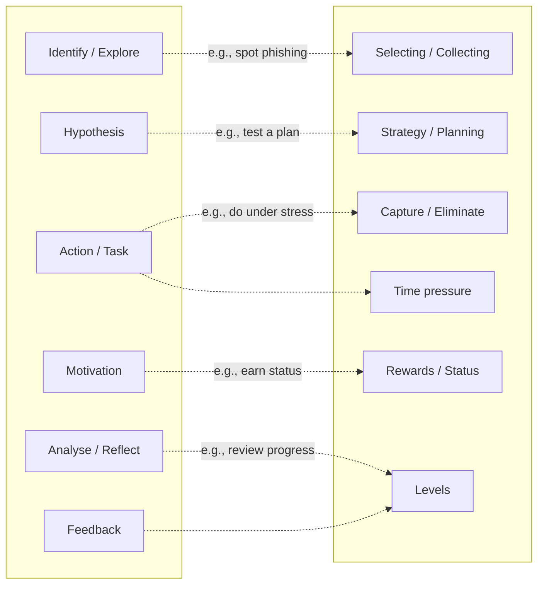
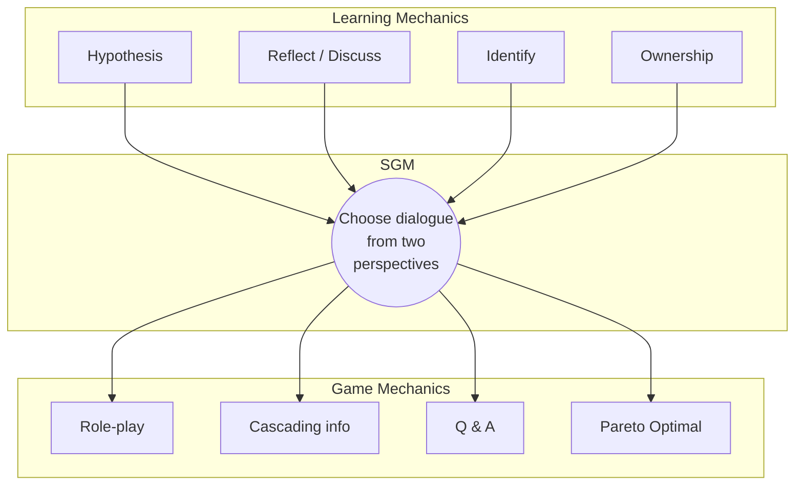
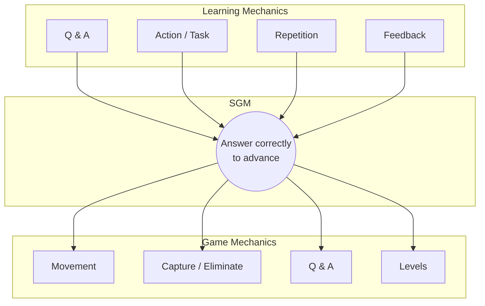

# DGBL: From Problem to Serious Game
## Stage 2: Design, Implement, or Iterate

A methodological guide for creating digital game-based learning experiences.

---
layout: center
---

# Outline

1. **Where we stand** — Stage 1 milestone, two paths ahead.
2. **The LM-GM framework** — how to bridge pedagogy and gameplay.
3. **Bloom alignment** — calibrating cognitive depth.
4. **Two tools for proof-of-concept** — Twine and GDevelop.
5. **Worked examples** — *Academical* (Twine) and *Adventure with Relational Algebra* (GDevelop).
6. **Path B** — the theoretical track.
7. **Stage 3** — peer review and the academic report.

---
layout: section
---

# Where We Stand
Recapping progress and setting the next goals.

---
layout: center
---

# Stage 1 Milestone Cleared

**Baseline successfully established.**

* **Research problem defined:** all groups have identified their core DGBL question.
* **Mandatory requirement met:** you are cleared to move into the active phase.
* **Focus from here on:** the quality of your process — whether deepening theory or building a prototype — will define your final outcome.

---
layout: center
---

# The Fork in the Road (Stage 2)

> Each group must commit to one of two distinct paths.

### Path A — The Builder
**Design & Implementation.** Map your research to a playable prototype using a framework like LM-GM.

### Path B — The Researcher
**Deepen the theoretical proposal.** No prototype — but the academic rigor goes up: stronger framework, more sources, sharper hypotheses.

*Both paths can reach top grades. They are evaluated against different rubrics, not against each other.*

---
layout: section
---

# Path A: Design Methodology
The bridge between research and gameplay.

---
layout: center
---

# The LM-GM Framework
### Learning Mechanics ↔ Game Mechanics

A descriptive model proposed by **Lim et al. (2013)** to bridge **pedagogical intent** and **playable actions** inside a Serious Game.

* **Learning Mechanics (LM):** what the player must learn — *Identify, Hypothesize, Analyse, Reflect*.
* **Game Mechanics (GM):** what the player actually does — *Collect, Capture/Eliminate, Manage Resources*.
* **Serious Game Mechanic (SGM):** the design decision that turns a learning goal into a playable action — the bridge between the two.

> *The pedagogical goal (LM) must map onto a play action (GM) that makes the learning invisible yet effective.*

---

# How to read the LM-GM map

Read it left-to-right: pedagogy on the left becomes gameplay on the right, through deliberate links.

  
<b>LEARNING MECHANICS</b> — what the player must <i>learn</i>

  
<b>GAME MECHANICS</b> — what the player actually <i>does</i>

A good Serious Game has **few, deliberate links**. Too many links = noise; none = gameplay disconnected from learning.

<!--
Talking points:
- LM nodes (left) come from pedagogical theory: behaviorism, constructivism, cognitivism. Examples in the slide are a non-exhaustive subset.
- GM nodes (right) come from game design literature: Järvinen, Sicart, etc.
- Dotted arrows are the SGMs — the design decisions you make. Each arrow is a hypothesis: "this game action will make this learning happen."
- Encourage students to draw their own LM-GM map for their Stage 1 problem before they pick a tool.
-->

---

# Bloom-aligned mapping (condensed)

Aligning **what the player thinks** with **what they do** in the game.

| Thinking skill (Bloom) | Sample LM | Sample GM |
|---|---|---|
| **Retention** | Discover, Repetition | Cut-scenes, Tokens |
| **Understanding** | Tutorial, Q&A | Tutorial, Cascading info |
| **Applying** | Action/Task, Simulation | Selecting/Collecting, Movement |
| **Analysing** | Identify, Observation | Feedback, Realism |
| **Evaluating** | Hypothesis, Reflect | Resource Management, Pareto Optimal |
| **Creating** | Ownership, Planning | Design/Editing, Strategy |

The higher the cognitive level, the more your **game mechanics must demand decisions, not reflexes**.

<!--
Speaker notes — what each row means:

- **Retention (lowest):** the player just needs to remember things. Cut-scenes deliver content; tokens reward recall. A flashcard app fits here.
- **Understanding:** the player can explain. Tutorials and Q&A test this. "Cascading info" = revealing context piece by piece, like a guided onboarding.
- **Applying:** the player uses what they learned in a known situation. Movement, sorting, simulating a procedure — all "apply" mechanics.
- **Analysing:** the player breaks something down. Identifying a phishing email by its parts, observing patterns. Realism here means the game gives enough texture to analyze.
- **Evaluating:** the player judges trade-offs. Resource management forces "is X worth more than Y here?" Pareto-optimal puzzles have multiple valid solutions.
- **Creating (highest):** the player makes something new. Design/editing tools (level editors, strategy planning). Minecraft-style.

Quick example to climb Bloom: "Capture/Eliminate" alone trains *Applying* (point and shoot). The same mechanic embedded in *Resource Management with consequences* (each shot costs ammo, ammo is scarce, enemies vary) climbs to *Evaluating*.

Push students: "What's the highest Bloom level your game realistically demands?" Most novice serious games stop at Understanding/Applying. That's fine for a prototype, but be honest about it.
-->

---
layout: center
---

# Quick Design Checklist

Before coding anything, your team must answer these 3 questions:

1. **What is the core loop?**
   *If the player spends 80% of their time jumping, the learning must happen during the jump.*

2. **Is there a direct LM ↔ GM link?**
   *Does this game mechanic actually carry your Stage 1 research question, or is it just decoration?*

3. **Is there "noise"?**
   *If a game element neither entertains nor teaches, cut it out immediately.*

---
layout: section
---

# Two Tools for Proof-of-Concept
Pick the one that matches your core loop.

---
layout: center
---

# Twine and GDevelop, side by side

Both tools are **free, open source, and exist to lower the technical barrier** so your team can ship a 3-minute playable prototype. They are not interchangeable: each fits a different kind of *core loop*.

* **[Twine](https://twinery.org/) — no-code, narrative.**
  Write text, add links, get an HTML game. Best for **decision-making, ethics, clinical reasoning, branching scenarios** — anywhere the LM is *Choose / Reflect / Identify*.

* **[GDevelop](https://gdevelop.io/) — low-code, action.**
  Visual event system (Conditions → Actions). Best for **spatial logic, resource management, time pressure, simulators** — anywhere the LM is *Action / Task / Analyse*.

> *Friendly does not mean limited.* Both have published, peer-reviewed serious games behind them. The next slides show one of each.

---
layout: section
---

# Worked Example 1
A real Twine serious game, analyzed with LM-GM.

---
layout: center
---

# Case study: *Academical*

A choice-based interactive narrative built in **Twine** to teach **Responsible Conduct of Research (RCR)**.

* **Authors:** Melcer, Ryan, Junius, Kreminski, Squinkifer, Hill, Wardrip-Fruin (UC Santa Cruz, ALT Games Lab).
* **Published in:** *FDG 2020* (ACM Foundations of Digital Games) — **Exceptional Paper Award**. Extended chapter in Springer (2022).
* **Evaluation:** controlled study vs. traditional web-based RCR materials; significant gains in engagement, moral reasoning, and knowledge.
* **Format:** 9 scenarios; each centers on a dialogue between two stakeholders. Player chooses lines; reaches one of several endings; replays from the *other* perspective.

> 🎮 Project page & paper: [altgameslab.soe.ucsc.edu/academical](https://altgameslab.soe.ucsc.edu/academical/)

---
layout: two-cols
---

# *Academical* — LM-GM map

::right::

| GM | LM | Implementation |
|---|---|---|
| Role-play | Ownership, Identify | Player controls one stakeholder per scenario |
| Cascading info | Reflect / Discuss | Each choice reveals new context |
| Q & A | Hypothesis | Dialogue options as multiple-choice |
| Pareto Optimal | Reflect / Discuss | Replay from the other perspective |

The replay-from-the-other-side mechanic turns a quiz on ethics into a serious game on *moral reasoning*.

---
layout: section
---

# Worked Example 2
A real GDevelop serious game, analyzed with LM-GM.

---
layout: center
---

# What makes GDevelop different

GDevelop is **event-based**: you write the game logic as a list of *Conditions → Actions*, no syntax.

* **Conditions** ask the world: *"Is the player touching an enemy?"*, *"Was the spacebar pressed?"*, *"Is the score ≥ 100?"*
* **Actions** change the world: *"Subtract 1 life"*, *"Play sound"*, *"Go to scene 'GameOver'"*.
* You drag, drop, and pick from menus. The same engine exports to web (HTML5), desktop, and mobile.

> The cognitive load lands on **game design**, not on syntax — which is exactly what you need for a 3-minute prototype.

*See the [GDevelop wiki](https://wiki.gdevelop.io/) for a tour of the editor.*

---
layout: center
---

# Case study: *Adventure with Relational Algebra*

A platformer serious game built in **GDevelop** as a proof of concept of a model for semi-automatic SG generation, used to reinforce **relational algebra** in a database course.

* **Authors:** Silva-Vásquez, Rosales-Morales, Benítez-Guerrero, Alor-Hernández, Mezura-Godoy, Montané-Jiménez (Universidad Veracruzana, México).
* **Paper:** *Model for Semi-Automatic Serious Games Generation*, **Applied Sciences** (MDPI, 2023) — [doi.org/10.3390/app13085158](https://doi.org/10.3390/app13085158)
* **Evaluation:** 75 university students, structured survey on gameplay, mechanics, story, and usability.
* **Format:** 2D platformer + multiple-choice gates between levels; correct answers progress, wrong ones cost a life.

> 🎮 Play it live: [gd.games/pedrosilva/algebra-relacional-bd](https://gd.games/pedrosilva/algebra-relacional-bd)

*The paper explicitly cites the LM-GM framework (Lim et al., 2013) as one of its conceptual references.*

---
layout: two-cols
---

# *Adventure with Relational Algebra* — LM-GM map

::right::

| GM | LM | Implementation |
|---|---|---|
| Movement | Action/Task | Run & jump across the level |
| Capture / Eliminate | Action/Task | Avoid enemies, collect items |
| Q & A | Q&A, Identify | Multiple-choice gates between levels |
| Levels | Repetition, Feedback | Wrong answer → lose life; correct → progress |

Remove the SGM and the game becomes Mario-Bros (no learning); remove the platforming and it becomes a quiz (no fun).

---
layout: center
---

# ⚠️ Golden Rule

> **Control your scope.**
>
> A 3-minute functional prototype that measures your variables is infinitely better than an unfinished epic.

---
layout: section
---

# Path B: The Theoretical Track
A more demanding alternative — not a fallback.

---
layout: center
---

# What Path B actually requires

Choosing **not to build** does **not** mean less work. It means a different kind of work, held to a higher academic standard:

* **Substantially expanded literature review:** broader corpus, explicit inclusion/exclusion criteria, Q1/Q2 sources.
* **Explicit theoretical framework:** position your problem inside an existing pedagogical or design theory (e.g., LM-GM, Bloom, Flow, EDTF, Self-Determination).
* **Sharpened hypothesis & operationalization:** define variables, measurable constructs, and a credible evaluation design — even if not executed.
* **Gap analysis with evidence:** show *why* the literature leaves your problem open, not just *that* it does.

*Path B is judged as a research proposal, not as a missing prototype.*

---
layout: center
---

# Stage 3: Closing the Loop

Whatever path you take, Stage 3 is the same in spirit:

* **Academic-style report** of your work.
* **Peer review** of other groups' submissions.
* **Final synthesis** integrating your reviewers' feedback.

*Detailed format and rubric will be released separately.*

---
layout: center
---

# References — Frameworks & Worked Examples

**Core framework**
* Lim, T., Carvalho, M. B., Bellotti, F., Arnab, S., de Freitas, S., Louchart, S., Suttie, N., Berta, R., & De Gloria, A. (2013). *The LM-GM Framework for Serious Games Analysis*. ECGBL.
* Anderson, L. W., & Krathwohl, D. (2001). *A Taxonomy for Learning, Teaching and Assessing: A Revision of Bloom's Taxonomy*. Longman.

**Worked examples**
* Melcer, E. F., Grasse, K., Ryan, J., Junius, N., Kreminski, M., Squinkifer, D., Hill, B., & Wardrip-Fruin, N. (2020). *Getting Academical: A Choice-Based Interactive Storytelling Game for Teaching Responsible Conduct of Research*. **FDG 2020** (ACM). 🎮 [altgameslab.soe.ucsc.edu/academical](https://altgameslab.soe.ucsc.edu/academical/)
* Silva-Vásquez, P. O., Rosales-Morales, V. Y., Benítez-Guerrero, E., Alor-Hernández, G., Mezura-Godoy, C., & Montané-Jiménez, L. G. (2023). *Model for Semi-Automatic Serious Games Generation*. **Applied Sciences, 13**(8), 5158. [doi.org/10.3390/app13085158](https://doi.org/10.3390/app13085158) · 🎮 [gd.games/pedrosilva/algebra-relacional-bd](https://gd.games/pedrosilva/algebra-relacional-bd)

---
layout: center
---

# References — Inclusive Design & Tools

**Inclusive design**
* Cano, S., et al. *The TEGA Toolkit* — [Springer chapter](https://link.springer.com/chapter/10.1007/978-3-030-77599-5_37). Cognitive accessibility, representation, and flexibility in serious games.

**Tools (free & open source)**
* [Twine](https://twinery.org/) — narrative, no-code, exports HTML.
* [GDevelop](https://gdevelop.io/) — 2D action, low-code event system, exports web/desktop/mobile.
* [GDevelop wiki](https://wiki.gdevelop.io/) — editor walkthrough and event reference.

---
layout: center
class: text-center
---

# Questions?

Bring your Stage 1 dossier and your draft LM-GM table to the next session.
